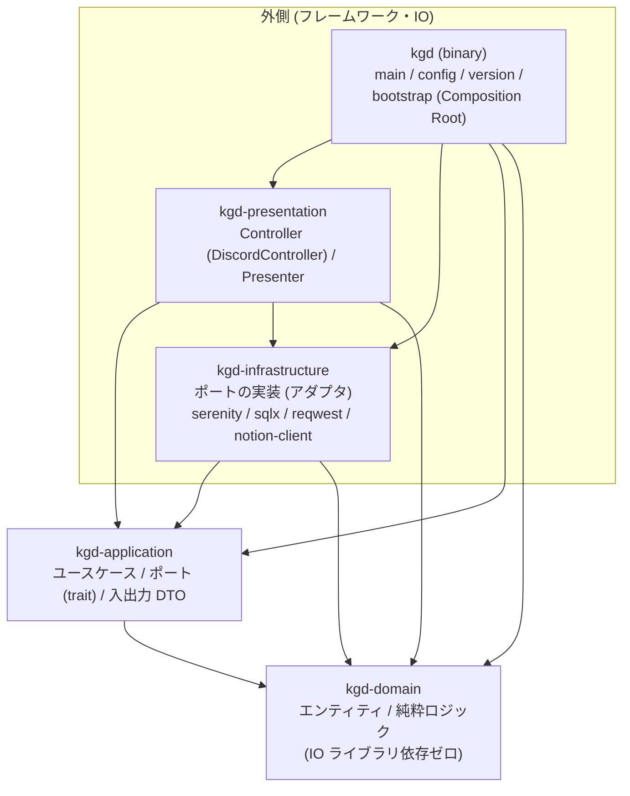
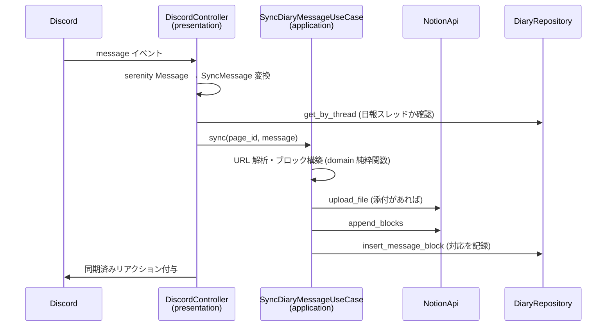
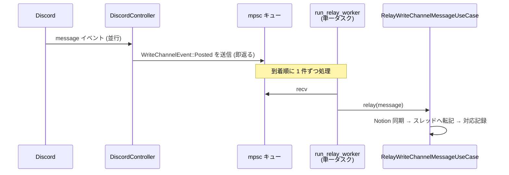
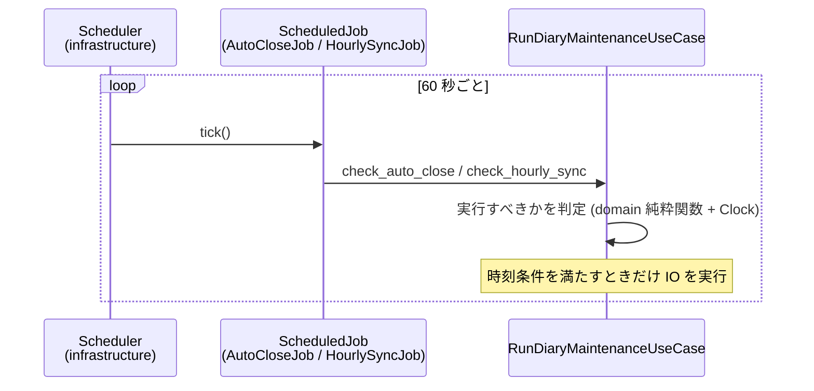

# アーキテクチャ

kgd はクリーンアーキテクチャに沿って、ワークスペースを層ごとの crate に分割している。
依存方向は常に外側から内側のみで、Cargo の依存関係によりコンパイル時に強制される。

設計判断の経緯は [ADR](adr/) に記録している。

## 層構成と依存方向

補足: kgd-presentation から kgd-infrastructure への依存は、serenity という同一フレームワークの
アダプタ (`to_sync_message` など) を共有するためのもの。依存方向の規則
（内側の層は外側を知らない）には違反しない。

## 各層の責務

| crate | 置くもの | 置かないもの |
|---|---|---|
| kgd-domain | エンティティ (DiaryEntry, SyncMessage など)、純粋関数 (URL 解析、OGP 解析、自動クローズ判定、転記本文の組み立て) | IO ライブラリへの依存すべて (serenity / sqlx / reqwest / tokio) |
| kgd-application | ユースケース (Interactor)、ポート (trait)、設定 DTO、ScheduledJob | ポートの実装、serenity / sqlx / reqwest への依存 |
| kgd-infrastructure | ポートの実装 (アダプタ)、マイグレーション、Scheduler ランナー | ビジネスロジック・判断ロジック |
| kgd-presentation | Discord イベントを受ける Controller (DiscordController)、結果を文言・embed に変換する Presenter | ビジネスロジック (ユースケース呼び出しに徹する) |
| kgd (binary) | 設定の読み込み、各層の組み立てと配線 (bootstrap) | 上記以外のロジック |

新しいコードを足すときの判断基準:

- 外部サービスや OS への入出力 → ポートを kgd-application に定義し、実装を kgd-infrastructure に置く
- 判断・変換のロジック → 可能な限り kgd-domain の純粋関数として書き、単体テストを付ける
- ユーザーへ見せる文言 → kgd-presentation の Presenter (純粋関数としてテスト可能に)

## ポートと実装の対応

| ポート (kgd-application) | 実装 (kgd-infrastructure) | テスト用モック |
|---|---|---|
| NotionApi | NotionClient | MockNotionApi |
| DiaryRepository | DiaryStore (sqlx / PostgreSQL) | MockDiaryRepository |
| DiscordGateway | SerenityGateway | MockDiscordGateway |
| OgpClient | OgpFetcher | MockOgpClient |
| AttachmentDownloader | ReqwestDownloader | MockAttachmentDownloader |
| ImageConverter | HeifConverter (libheif) | MockImageConverter |
| Clock | SystemClock | MockClock |
| WolSender | UdpWolSender | MockWolSender |
| ServerProber | SurgeProber (ICMP ping) | MockServerProber |

モックは `#[cfg_attr(test, mockall::automock)]` による自動生成。
ユースケースの単体テストは `cargo test -p kgd-application` で、serenity / sqlx / libheif を
ビルドせずに実行できる。

## ユースケース一覧

| ユースケース | 役割 |
|---|---|
| SyncDiaryMessageUseCase | メッセージを Notion ページへ同期 (添付アップロード、URL 変換、OGP 取得) |
| RelayWriteChannelMessageUseCase | 書き込み用チャンネルの投稿を今日の日報スレッドへ転記し、編集・削除に追従 |
| ManageDiaryLifecycleUseCase | 日報スレッドの作成・再開・クローズ、クローズ & 新規作成 |
| RunDiaryMaintenanceUseCase | 自動クローズ確認、毎時の未同期メッセージ走査 |
| WakeServerUseCase | Wake-on-LAN パケットの送信 |
| CheckServerStatusUseCase | サーバー死活確認 |

## 代表的な処理フロー

### メッセージ同期 (日報スレッドへの投稿)

### 書き込み用チャンネルからの転記 (順序保証)

Discord のイベントハンドラはイベントごとに並行実行されるため、転記処理はキューを介して
単一ワーカーが直列に処理する。これによりスレッドへの転記順と Notion のブロック順が
投稿順に揃う ([ADR-0005](adr/0005-serialize-write-channel-relay.md))。

### 定時処理

ジョブの追加は ScheduledJob trait の実装と bootstrap での register のみ
([ADR-0004](adr/0004-minimal-scheduler-with-job-self-decision.md))。

## テスト戦略

- 判断・変換ロジックは kgd-domain の純粋関数とし、時刻や IO の結果は引数で受ける
- ユースケースはポートのモック (mockall) で、呼び出し順序・回数・引数を検証する
- Presenter の文言・embed 組み立ては純粋関数としてテストする
- アダプタ (infrastructure) は薄く保ち、単体テストの対象にしない
- 単体テストは各モジュールの `mod tests` (ディレクトリモジュールの tests.rs / tests/) に置く
