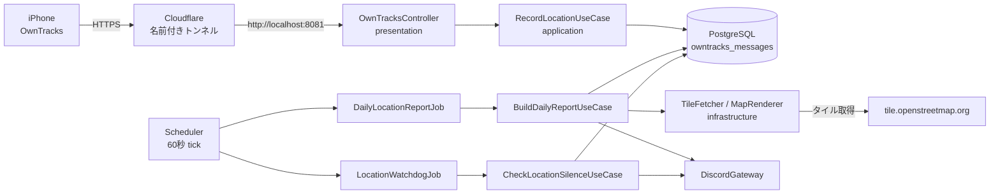

# OwnTracks 位置ログの受信と日次レポート 設計

## 背景

iPhone の OwnTracks (HTTP モード) から位置情報を受け取り、記録して振り返る仕組みを本番運用したい。

現在は試験構成として、Raspberry Pi (aoi) 上に Python の受け口 (`~/services/owntracks`)、Cloudflare のクイックトンネル、死活監視の systemd timer を置いて動かしている。2026-09-13 から 2026-09-19 までの実測で、約 80 時間・4329 点を欠測なく記録できることを確認した。この構成には次の問題がある。

- クイックトンネルは cloudflared を再起動するたびに URL が変わり、そのつど端末側の設定を打ち直す必要がある
- データが JSONL のため、集計や期間指定の取り出しに毎回スクリプトを書くことになる
- kgd とは別のランタイム (Python) と別の常駐プロセス群を運用することになる

kgd は既に Discord bot・PostgreSQL・定時ジョブの基盤を持っているため、これを取り込んで一本化する。

## 目的

- OwnTracks のメッセージを kgd が直接受信し、PostgreSQL に永続化する
- 1 日分の軌跡を地図画像としてプロットし、翌朝 Discord へ自動投稿する
- 位置情報が途絶えたことを検知して通知する
- 試験運用で溜めた JSONL を取り込み、過去日も同じ仕組みで扱えるようにする

## 非目標

次の 2 つは今回のスコープに含めない。必要になった時点で別途設計する。

- **受信した点を 1 件ずつ Discord へ逐次転送すること**。試験運用では webhook で流していたが、本番ではノイズになるため日次レポートに集約する
- **端末へのコマンド送信** (`reportLocation` などを HTTP 応答に載せて配信する機能)

移動の「区切り」(滞在と移動への分割、トリップ単位の要約) も今回は行わない。生データを溜めることを優先し、閾値の決定は実データが揃ってから別途設計する。

## 方式の選定

### HTTP の受け口

kgd はこれまで HTTP サーバーを持たず、serenity の gateway 接続と reqwest のクライアント側のみだった。受信のために axum を追加する。

### 地図描画

タイルベースの地図描画クレートとして `staticmap` を検討したが**採用しない**。依存する `attohttpc` が **MPL-2.0** であり、`deny.toml` の許可リスト (MIT / Apache-2.0 / BSD-2 / BSD-3 / ISC / Zlib / Unicode-3.0 / CDLA-Permissive-2.0) に含まれないため `cargo deny check` を通らない。ほかにも次の難点がある。

- HTTP クライアントが同期の attohttpc であり、tokio ランタイム上でブロッキング呼び出しになる
- タイル取得の User-Agent を差し替えられない。OpenStreetMap のタイル利用規約は識別可能な User-Agent を要求する
- `tiny-skia 0.11` に固定されており、最新の 0.12 と重複する (`bans.multiple-versions = "warn"`)
- 上流の更新が 2024-01 で止まっている

代わりに **`tiny-skia` を直接使う**。staticmap が描画に用いているのと同じクレートであり、線の太さ・色・アンチエイリアスはクレートに任せられる。タイルの取得は既存の `reqwest` で行い、User-Agent とキャッシュを自前で制御する。

### 新規に追加する依存

| クレート | ライセンス | 用途 |
|---|---|---|
| axum | MIT | OwnTracks からの HTTP 受信 |
| tiny-skia | BSD-3-Clause | 軌跡の描画 |

いずれも許可リストに含まれる。タイル PNG のデコードは既存の `image`、HTTP クライアントは既存の `reqwest`、非同期基盤は既存の `tokio` を使う。

## 全体構成



層の配置は [architecture.md](../../architecture.md) の規則に従う。

| crate | 追加するもの |
|---|---|
| kgd-domain | 位置のエンティティ、Web メルカトル投影、ズーム決定、外れ値の除去、移動種別による区間分割、距離と時間の集計 |
| kgd-application | `RecordLocationUseCase` / `BuildDailyReportUseCase` / `CheckLocationSilenceUseCase`、ポート `LocationRepository` `MapRenderer`、ジョブ 2 種 |
| kgd-infrastructure | `LocationStore` (sqlx)、`TileMapRenderer` (reqwest + tiny-skia + image)、axum サーバーのランナー、マイグレーション |
| kgd-presentation | `OwnTracksController` (axum のルータ)、レポートと警報の文面を組み立てる Presenter |
| kgd (binary) | `[location]` 設定、bootstrap での配線、`import-owntracks` サブコマンド |

## 受信と保存

### HTTP の仕様

| メソッド / パス | 挙動 |
|---|---|
| `POST /pub` | Basic 認証。ボディは単一オブジェクトまたは配列。**常に `200` と JSON 配列 `[]` を返す** |
| `GET /healthz` | 疎通確認。`200` と `{"ok":true}` |

- 応答が空ボディや非配列だと端末が失敗と解釈するため、`[]` を返すことは必須要件とする
- 端末の識別は `X-Limit-U` / `X-Limit-D` ヘッダを優先し、無ければクエリ `?u=&d=`、それも無ければ `unknown` とする (OwnTracks はどちらの方式でも送りうる)
- ボディ上限は 1 MiB。超過は `413`
- 認証失敗は `401` と `WWW-Authenticate: Basic`。axum がボディを読み切るため、試験運用の Python 実装で踏んだ keep-alive 時の不正リクエスト扱いは構造的に発生しない
- 待ち受けポートの既定は **8081**。移行期間中、8080 で動く Python 受け口と並走させるため

### テーブル

マイグレーションを `crates/kgd-infrastructure/migrations/` に 1 ファイル追加する。日報と同じデータベースに相乗りする。

```sql
CREATE TABLE owntracks_messages (
    id          BIGSERIAL PRIMARY KEY,
    user_id     TEXT        NOT NULL,
    device_id   TEXT        NOT NULL,
    msg_type    TEXT        NOT NULL,
    tst         TIMESTAMPTZ,
    received_at TIMESTAMPTZ NOT NULL,
    lat         DOUBLE PRECISION,
    lon         DOUBLE PRECISION,
    acc         INTEGER,
    alt         INTEGER,
    vel         INTEGER,
    batt        SMALLINT,
    trigger_type TEXT,
    motion      TEXT,
    payload     JSONB       NOT NULL,
    UNIQUE (user_id, device_id, msg_type, tst)
);

CREATE INDEX owntracks_messages_device_tst_idx
    ON owntracks_messages (user_id, device_id, tst);

CREATE TABLE owntracks_report_posts (
    date      DATE PRIMARY KEY,
    posted_at TIMESTAMPTZ NOT NULL
);
```

設計上の要点は 2 つ。

- **レポートに使う項目だけ型付きの列にし、メッセージ全体を `payload` に残す。** 後から別の項目が必要になっても再取り込みが要らない
- **`UNIQUE (user_id, device_id, msg_type, tst)` と `ON CONFLICT DO NOTHING` で冪等にする。** 端末は圏外から復帰すると同じ点を送り直す (実測で最大 4160 秒遅れの再送を確認)。JSONL の取り込みも同じ経路を通るため、何度実行しても重複しない

`tst` が NULL になりうるメッセージ (`waypoints` など) は、PostgreSQL では NULL 同士が相異なると扱われるため UNIQUE 制約が効かず重複しうる。量が少なく実害がないため許容する。

列名を `trigger` ではなく `trigger_type` にしているのは、`TRIGGER` が SQL のキーワードであり、引用符なしで書けるようにするため。

日次レポートは端末と日付で範囲を絞って取り出すため、インデックスは `(user_id, device_id, tst)` の複合とする。

### 接続プールの共有

現在 `DiaryStore::connect` がプールの生成とマイグレーション実行を兼ねている。これを **bootstrap で `PgPool` を 1 本作り、`DiaryStore` と `LocationStore` に配る**形に変更する。データベース URL は `[diary].database_url` の 1 箇所を正とし、`[location]` には置かない。マイグレーションは起動時に 1 回だけ実行する。

## 日次レポート

### 投稿のタイミング

`DailyLocationReportJob` を `ScheduledJob` として登録する ([ADR-0004](../../adr/0004-minimal-scheduler-with-job-self-decision.md) の方針どおり、60 秒 tick のランナーに相乗りし、実行可否はジョブ側で判定する)。

判定は純粋関数とする。

```
should_post(now, last_posted_date, report_hour, tz) -> Option<NaiveDate>
```

- 1 日の区切りは `[location].timezone` (既定 `Asia/Tokyo`) の 0:00〜24:00
- `report_hour` (既定 7) を過ぎており、前日分が未投稿であれば投稿する
- 投稿済みの日付は `owntracks_report_posts` に記録する。再起動による二重投稿を防ぎ、停止していた期間があれば古い日から順に追いつく

### 描画

3 段に分け、判断を伴う部分を domain の純粋関数に寄せる。

| 段 | 層 | 内容 |
|---|---|---|
| 1. 範囲とズームの決定 | domain | 点群から bbox を求め、指定サイズに収まる最大ズームを選ぶ (3〜17 にクランプ)。**bbox が潰れる場合** (1 点のみ、終日ほぼ静止) は固定ズーム 15 で中心に配置する |
| 2. 投影 | domain | 緯度経度から Web メルカトルのピクセル座標へ変換する |
| 3. 描画 | infrastructure | タイルを取得し、tiny-skia の Pixmap へ貼り、折れ線を引き、PNG へエンコードする |

外れ値の除去も domain の純粋関数とする。`[location].max_accuracy_m` (既定 200) を超える `acc` の点は捨てる。実測データに `acc = 1414` の点が 2 件あり、除去しないと軌跡が大きく飛ぶ。

### 移動種別による色分け

`motionactivities` の先頭要素で軌跡を塗り分ける。

| 種別 | 描画 |
|---|---|
| `walking` | 緑の線 |
| `automotive` | 青の線 |
| `cycling` | 橙の線 |
| `stationary` | 線を引かず点で示す (静止中の GPS の揺れを軌跡として描かないため) |
| 欠損 | 灰の線 |

**欠損の補完は行わない。** 実測 11202 点のうち 2436 点 (22%) が欠損しており、欠損ブロックの長さは中央値 2 点と短い。しかし直前の値で埋める方式の妥当率は 58% にとどまり、塗り分けがちらつく。

点列を種別ごとの連続区間に分割する関数は `Option<Activity>` をそのまま扱う。補完ルール (速度からの推定、前後が一致するときのみ埋める等) を後から導入する場合も、この関数の内部だけで完結し、描画側のインターフェイスは変わらない。

### タイルの取得

OpenStreetMap の公式タイルを使う。利用規約を満たすため次を守る。

- URL は `https://tile.openstreetmap.org/{z}/{x}/{y}.png` (`a`/`b`/`c` のサブドメインは使わない)
- User-Agent に `kgd/<version> (+https://github.com/ekuinox/kgd)` を設定する
- 取得したタイルは `[location].tile_cache_dir` にキャッシュし、同じタイルを取り直さない
- 1 日 1 回・16〜25 枚程度の取得に限る

**`© OpenStreetMap contributors` の表示は必須。** 画像に文字を焼くとフォントとグリフのクレートが増えるため、**Discord の embed の footer にテキストとして入れる**。これにより依存を増やさずに要件を満たす。

### 投稿の内容

`DiscordGateway` ポートに画像添付のメソッドを 1 つ追加する (現状は平文とボタン付きメッセージの送信のみ)。

```rust
async fn send_image(
    &self,
    channel_id: u64,
    content: &str,
    filename: &str,
    bytes: Vec<u8>,
) -> Result<u64>;
```

`MockDiscordGateway` は `automock` により自動で追従する。投稿先は `[location].report_channel_id`。

embed には画像に加えて、同じデータから算出できる数値を載せる。地図だけでは読み取れない情報を補うため。

- 記録点数 (除去した外れ値の数を含む)
- 移動距離の合計 (ハバサインによる積算。domain の純粋関数)
- 移動していた時間と静止していた時間
- 最初と最後の記録時刻
- 移動種別の内訳 (凡例を兼ねる)

## 死活監視

`LocationWatchdogJob` を `ScheduledJob` として追加する。

- 判定は純粋関数 `should_alert(now, latest_tst, threshold, currently_alerting)` とし、「途絶」と「復帰」の 2 種類の通知を返す
- `LocationRepository::latest_location_tst()` で最新の `tst` を取得する
- しきい値は `[location].silence_threshold` (既定 `30m`、`humantime_serde` で他の設定と同じ書式)
- 通知先は `[location].alert_channel_id`。省略時は `report_channel_id`
- 文面の組み立ては presentation の Presenter (純粋関数)

**警報中かどうかの状態はユースケース内のメモリに持つ。** 永続化するほどの価値がないため。ただし途絶している最中に kgd を再起動すると、警報がもう一度送られる。これは許容する仕様とする。

## JSONL の取り込み

`main.rs` は現在 `--config` と `--init` のフラグのみでサブコマンドを持たない。`--init` の挙動を変えずに clap のサブコマンドを追加する。引数なしでの起動は従来どおり常駐とする。

```
kgd import-owntracks <path>...
```

- ディレクトリを渡した場合は配下の `*.jsonl` を再帰的に収集する
- 1 行 1 メッセージとして読み、**受信時と同じ `RecordLocationUseCase` を通す**。パースと正規化を二重に実装しない
- 冪等性は UNIQUE 制約と `ON CONFLICT DO NOTHING` に委ねる
- `_received_at` があればそれを `received_at` に使い、無ければ `tst` で代用する
- 壊れた行はスキップして数え、最後に「取り込み / 既存 / スキップ」の件数を出力する
- 完了後は常駐せずに終了する

JSONL は aoi のホスト側にあり kgd は Docker 上で動くため、取り込み時のみ読み取り専用でマウントする。`compose.yml` には常設しない。

```sh
docker compose run --rm -v ~/services/owntracks/data:/import:ro kgd import-owntracks /import
```

## 設定

`config.toml` に `[location]` セクションを追加する。

```toml
[location]
# HTTP 受け口
listen = "0.0.0.0:8081"
username = "ekuinox"
password = "..."

# 日次レポート
report_channel_id = 123456789012345678
report_hour = 7                  # 前日分をこの時刻以降に投稿する
timezone = "Asia/Tokyo"
max_accuracy_m = 200
image_width = 1024
image_height = 1024
tile_cache_dir = "/var/lib/kgd/tiles"

# 死活監視
silence_threshold = "30m"
# alert_channel_id = 123456789012345678   # 省略時は report_channel_id
```

データベース URL は `[diary].database_url` を共用するため `[location]` には持たせない。

## 移行手順

### 名前付きトンネルへの切り替え

cloudflared は systemd user サービスではなく compose に同梱する。kgd と同じ再起動ポリシーで揃い、常駐プロセスの管理先が 1 つ減るため。

1. Cloudflare Zero Trust ダッシュボードでトンネルを作成する (ブラウザでの操作が必要なため利用者が実施する)
2. 発行されたコネクタトークンを `.env` の `CLOUDFLARE_TUNNEL_TOKEN` に設定する (`.env` は git 管理外)
3. ダッシュボードの ingress 設定で `<サブドメイン>` を `http://localhost:8081` に向ける
4. `docker compose --profile tunnel up -d` で kgd・PostgreSQL・cloudflared をまとめて起動する

ingress 設定はダッシュボード側に保存されるため、リポジトリには残らない。再構築時はダッシュボードを参照する。

**Cloudflare Access は使わない。** OwnTracks はブラウザではないため Access のログイン画面を通過できない。認証は Basic 認証を継続する。

### 切り替えの順序

1. kgd を 8081 で起動する。Python の受け口 (8080) は停止しない
2. `import-owntracks` で JSONL を取り込む
3. 取り込んだデータで日次レポートを生成し、画像と数値を確認する
4. iPhone の URL を名前付きトンネルへ変更する。これ以降の実データは kgd に入る
5. 1 日並走させ、レポートの自動投稿と死活監視の誤報がないことを確認する
6. Python 側を停止する (`systemctl --user disable --now owntracks-recv cloudflared-quick owntracks-watchdog.timer`)
7. `~/services/owntracks` と JSONL は当面残す

切り戻しは iPhone の URL をクイックトンネルへ戻し、Python 側を起動し直すだけでよい。データは JSONL と PostgreSQL の両方に残る。

なお**この移行により Discord への逐次転送は止まる**。日次レポートまで何も流れてこなくなる点を、切り替え前に確認する。

## テスト戦略

既存の方針 (判断ロジックは domain の純粋関数、ユースケースは mockall で検証、アダプタは薄く保つ) に従う。

| 対象 | 方法 |
|---|---|
| 投影・ズーム決定 | 既知の緯度経度とタイル座標で検算する。bbox が潰れる場合の分岐も含める |
| 外れ値の除去 | 実測値 (`acc = 1414`) を用いた境界テスト |
| 移動種別の区間分割 | 欠損を挟む列、末尾が欠損、全件欠損などのケース |
| 距離と時間の集計 | 既知の 2 点間距離での検算 |
| 投稿タイミングの判定 | `Clock` を注入し、境界時刻、未投稿日が複数ある場合、二重投稿しないことを検証する |
| 死活監視の判定 | 途絶から警報、復帰までの遷移と、警報中の再 tick で重複して鳴らないこと |
| 受信ユースケース | `MockLocationRepository` で配列ボディ・単一ボディ・重複投入を検証する |
| HTTP の口 | axum のルータへ直接リクエストを流し、`401` / `413` / `[]` を検証する |
| タイル取得 | `NotionClient` と同様にベース URL をスタブ HTTP サーバーへ差し替え、User-Agent の付与とキャッシュの動作を検証する |

`cargo test -p kgd-application` が sqlx / serenity / libheif をビルドせずに通る性質は維持する。

## ADR の候補

実装時に次の判断を ADR として記録する。

- 地図描画に staticmap を採用せず tiny-skia を直接使う判断 (ライセンスと User-Agent 制御が理由)
- 移動種別の欠損を補完しない判断 (実測した妥当率 58% が根拠)

## 既知の制約

- 途絶中に kgd を再起動すると死活監視の警報が再送される
- `tst` を持たないメッセージは重複を排除できない
- クイックトンネルから名前付きトンネルへの切り替え時、端末側の URL 変更が 1 回だけ必要になる
- OpenStreetMap のタイル利用規約に依存するため、レポートの生成頻度を大きく上げる場合は再検討が必要になる
