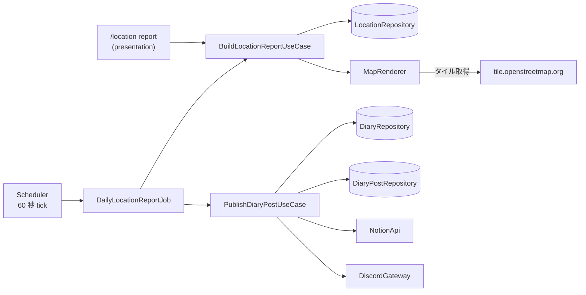

# 位置ログの日次レポートと日報への投稿 設計

## 背景

OwnTracks の位置情報は #88 で kgd が受信して PostgreSQL に保存するようになり、Python の受け口は停止した。
試験運用では受信した点を Discord へ逐次転送していたが、これも止まっている。
そのため現在は、記録された軌跡を振り返る手段が無い。

[前回の設計書](2026-09-21-owntracks-location-tracking-design.md) は日次レポートを「翌朝、専用チャンネルへ投稿する」形で設計していた。
本設計はこれを次の 2 点で置き換える。

- 定時のレポートは専用チャンネルではなく、その日の日報スレッドと Notion ページに載せる
- 任意の日のレポートを確認する Discord のスラッシュコマンドを追加する

描画方式 (tiny-skia の直接利用、OSM タイル、移動種別の色分け) は前回の設計を引き継ぐ。

## 目的

- 日報日ごとの軌跡を地図画像と集計値にまとめ、その日の日報スレッドと Notion ページへ自動で投稿する
- `/location report` で、任意の日報日のレポートを本人だけに見える返信で確認できるようにする
- 「bot が作った内容を指定した日報日のスレッドと Notion に載せる」処理を、位置情報から独立した汎用の仕組みとして用意する。今後、同種の定時投稿が増えることを見込む
- 将来 CLI からレポートを出力できるよう、レポートの生成を配信先から切り離す

## 非目標

- **死活監視**。別の設計書で扱う
- **全データの閲覧**。別の設計書で扱う
- **CLI のサブコマンドによるレポート出力**。モジュールの分割だけを本設計で担保する
- **書き込みチャンネルからの転記との共通化**。転記は人の投稿の編集と削除に追従する仕組みであり、bot の投稿を一度だけ載せる本設計の仕組みとは性質が違う
- **端末による絞り込み**。記録している端末は 1 台であり、レポートは保存されている全端末の点を使う

## 全体構成

レポートを「作る」処理と「届ける」処理を分ける。
作る側は日報日を受け取って画像と集計値を返すだけにし、Discord と Notion を知らない。
届け方ごとに作る側を呼び出す。



| 届け方 | 呼び出すもの | 出力 |
|---|---|---|
| 定時ジョブ | `BuildLocationReportUseCase` → `PublishDiaryPostUseCase` | 日報スレッドと Notion ページ |
| スラッシュコマンド | `BuildLocationReportUseCase` | 本人だけに見える返信 (ephemeral) |
| CLI (将来) | `BuildLocationReportUseCase` | PNG ファイルと標準出力 |

層ごとに追加するものは次のとおり。
層の規則は [architecture.md](../../architecture.md) に従う。

| crate | 追加するもの |
|---|---|
| kgd-domain | `location/` モジュール (軌跡の点、外れ値の除去、移動種別による区間分割、距離と時間の集計、Web メルカトル投影、表示範囲とズームの決定、レポートの文言)。`DiaryPost` 型。`DiaryCalendar` への日報日の範囲と前日を返すメソッド |
| kgd-application | `BuildLocationReportUseCase`、`PublishDiaryPostUseCase`、`DailyLocationReportJob`。ポート `MapRenderer` と `DiaryPostRepository`。`LocationRepository` と `DiscordGateway` へのメソッド追加 |
| kgd-infrastructure | `TileMapRenderer` (reqwest + tiny-skia)、`DiaryPostStore`、`LocationStore` の拡張、`send_text_with_images` の実装、マイグレーション |
| kgd-presentation | `/location report` コマンド、レポートの embed を組み立てる Presenter |
| kgd (binary) | `[location]` の設定項目の追加、bootstrap での配線 |

## 日報日の範囲

レポートの 1 日は日報日と揃え、`[diary]` の `DiaryCalendar` (タイムゾーンと `day_start_hour`) で決める。
`day_start_hour` が既定の 8 なら、2026-09-28 のレポートは 2026-09-28 08:00 から 2026-09-29 08:00 までの点を対象とする。
暦日 (0 時から 24 時) で区切ると、日報に書いた深夜の出来事と軌跡が別の日に分かれてしまうためである。

`DiaryCalendar` に次のメソッドを追加する。

```rust
/// 日報日の開始時刻と終了時刻 (終了は含まない) を UTC で返す。
pub fn day_range(&self, date: NaiveDate) -> (DateTime<Utc>, DateTime<Utc>);
```

前回の設計書にあった `[location].timezone` と `report_hour` は設けない。

## レポートの生成

### BuildLocationReportUseCase

```rust
pub async fn build(&self, date: NaiveDate, until: Option<DateTime<Utc>>) -> Result<LocationReport>;
```

- `date` の日報日の範囲にある点を `LocationRepository::locations_between(start, end)` で取り出す。`until` を渡すと、終了時刻をそれより前に切り詰める (スラッシュコマンドで進行中の日報日を「今まで」の分だけ見るため)
- 対象は `msg_type = 'location'` で緯度経度を持つ点に限る
- 点が 0 件なら、画像を持たない `LocationReport` を返す
- 外れ値の除去、区間分割、集計は domain の純粋関数で行い、描画だけを `MapRenderer` ポートに任せる

```rust
pub struct LocationReport {
    /// 対象の日報日
    pub date: NaiveDate,
    /// 集計に使った範囲
    pub range: (DateTime<Utc>, DateTime<Utc>),
    /// 集計値
    pub summary: LocationSummary,
    /// 地図画像 (PNG)。点が 0 件なら None
    pub image: Option<Vec<u8>>,
}
```

### 外れ値の除去と区間分割

前回の設計書のとおりとする。

- `acc` が `[location].max_accuracy_m` (既定 200) を超える点は捨てる
- `motion` (motionactivities の先頭要素) で連続区間に分割する。欠損は補完せず `None` のまま扱う

### 集計

`LocationSummary` は次の値を持つ。

- 記録点数と、精度不足で除外した点数
- 移動距離の合計と、移動種別ごとの内訳 (ハバサイン距離の積算)
- 移動していた時間と静止していた時間
- 最初と最後の記録時刻

時間は、隣り合う 2 点の間隔を前の点の移動種別に割り当てて積算する。
`stationary` は静止、それ以外は移動 (欠損も移動側の「不明」) とする。
OwnTracks の `running` は `walking` と同じ徒歩として扱い、`unknown` と未知の値は欠損として扱う。
ただし間隔が 15 分を超える区間は、どちらにも数えない。
圏外などで記録が途切れていた時間を積算すると、実際には把握できていない時間が移動や静止として計上されるためである。

距離も同じ規則で、間隔が 15 分を超える区間は積算しない。
静止の区間も距離に積算しない。静止中の GPS の揺れが移動距離として計上されるためである。

### 描画

判断を伴う部分は domain の純粋関数とする。

| 段 | 層 | 内容 |
|---|---|---|
| 1. 範囲とズームの決定 | domain | 点群の bbox が指定サイズに収まる最大ズームを選ぶ (3 から 17 にクランプ)。1 点のみ、または終日ほぼ静止して bbox が潰れる場合は、ズーム 15 で中心に置く |
| 2. 投影 | domain | 緯度経度を Web メルカトルのピクセル座標へ変換する |
| 3. 描画 | infrastructure | タイルを取得して tiny-skia の Pixmap に貼り、区間ごとに線を引き、PNG にエンコードする |

`MapRenderer` ポートは、投影済みの区間と表示範囲を受け取って PNG を返す。

```rust
#[async_trait::async_trait]
pub trait MapRenderer: Send + Sync {
    async fn render(&self, viewport: &Viewport, segments: &[TrackSegment]) -> Result<Vec<u8>>;
}
```

移動種別の色分けは前回の設計書のとおりとする。

| 種別 | 描画 |
|---|---|
| `walking` | 緑の線 |
| `automotive` | 青の線 |
| `cycling` | 橙の線 |
| `stationary` | 線を引かず点で示す |
| 欠損 | 灰の線 |

### タイルの取得

- URL は `https://tile.openstreetmap.org/{z}/{x}/{y}.png`
- User-Agent に `kgd/<version> (+https://github.com/ekuinox/kgd)` を設定する
- 取得したタイルは `[location].tile_cache_dir` に保存し、同じタイルを取り直さない
- **取得に失敗したタイルは灰色で塗り、描画を続ける。**
  失敗を描画全体の失敗にすると、定時ジョブが毎分再試行して OSM へ繰り返し取りにいくことになり、利用規約の面で望ましくない。
  軌跡と集計値が載ることを優先する

`© OpenStreetMap contributors` の表記は本文に入れる (後述)。

## 日報への投稿

### DiaryPost

bot が作った内容を日報に載せる単位を domain に定義する。

```rust
/// 日報日のスレッドと Notion ページへ載せる bot の投稿。
pub struct DiaryPost {
    /// 投稿を一意に識別するキー (例: "location-report:2026-09-28")
    pub key: String,
    /// 載せる先の日報日
    pub date: NaiveDate,
    /// 本文 (プレーンテキスト)
    pub text: String,
    /// 添付する画像
    pub images: Vec<DiaryPostImage>,
}

pub struct DiaryPostImage {
    pub filename: String,
    pub content_type: String,
    pub bytes: Vec<u8>,
}
```

Discord の embed は Notion に対応するものが無いため使わない。
スレッドには本文と画像の添付として、Notion には段落と画像のブロックとして載せ、両者の見た目を揃える。

### PublishDiaryPostUseCase

```rust
pub async fn is_done(&self, key: &str) -> Result<bool>;
pub async fn publish(&self, post: DiaryPost) -> Result<PublishOutcome>;

pub enum PublishOutcome {
    /// 今回の呼び出しで載せ終えた
    Published,
    /// 以前に載せ終えていた、またはスキップ済み
    AlreadyDone,
    /// 日報が無いためスキップとして記録した
    NoDiary,
}
```

`is_done` は、呼び出し側が重い内容の生成を省くために使う。
これが無いと、定時ジョブは完了済みかどうかを知るために毎分レポートを描画することになる。

`publish` の手順は次のとおり。

1. `diary_posts` の記録を引く。Notion とスレッドの両方が済んでいるか、スキップ済みなら `AlreadyDone` を返す
2. `DiaryRepository::get_by_date` で日報エントリを探す。無ければスキップとして記録し、`NoDiary` を返す
3. Notion が未完了なら、画像を `upload_file` し、本文の段落と画像のブロックをページ末尾へ `append_blocks` する。終えたら `notion_posted_at` を記録する
4. スレッドが未完了なら、`thread_state` で状態を確かめる。クローズ済みなら `reopen_thread` で再開し、`send_text_with_images` で投稿し、`close_thread` で元に戻す。投稿に失敗しても元に戻す処理は必ず試みる。終えたら `thread_message_id` と `thread_posted_at` を記録する

Notion を先に載せるのは、スレッドの再開やクローズで失敗しても Notion 側に内容を残すためである。
段ごとに記録するので、途中で失敗した場合も次の呼び出しで残りの段だけをやり直し、二重には載らない。
投稿に成功したあとでクローズへ戻せなかった場合は、警告のログに留めて投稿済みとして記録する。
ここで失敗を返すと、次の呼び出しで同じ内容をスレッドへもう一度投稿してしまうためである。

クローズ済みのスレッドを再開せずに直接書き込めるか (bot のスレッド管理権限で locked のスレッドへ投稿できるか) は確認できていない。
実装時に実機で確かめ、書き込めるなら再開とクローズを省く。

bot の投稿はメッセージ同期と毎時の走査の両方で無視されるため (`is_bot`)、スレッドへの投稿が Notion へ二重に同期されることはない。

### DiaryPostRepository とテーブル

```sql
CREATE TABLE diary_posts (
    post_key          TEXT        PRIMARY KEY,
    diary_date        DATE        NOT NULL,
    notion_posted_at  TIMESTAMPTZ,
    thread_message_id BIGINT,
    thread_posted_at  TIMESTAMPTZ,
    skipped_at        TIMESTAMPTZ
);
```

前回の設計書の `owntracks_report_posts` は作らず、このテーブルで置き換える。
位置情報に限らず、今後の定時投稿も同じテーブルで冪等性を担保する。

### DiscordGateway への追加

```rust
/// 本文と画像を添付したメッセージを送信し、メッセージ ID を返す。
async fn send_text_with_images(
    &self,
    channel_id: u64,
    content: &str,
    images: &[DiaryPostImage],
) -> Result<u64>;
```

## 定時ジョブ

`DailyLocationReportJob` を `ScheduledJob` として登録する ([ADR-0004](../../adr/0004-minimal-scheduler-with-job-self-decision.md))。
tick ごとに次を行う。

1. 対象は「現在の日報日の 1 つ前の日報日」とする。判定は `DiaryCalendar::previous_date(now) -> NaiveDate` とする
2. キー `location-report:<日付>` で `is_done` を確かめ、済んでいれば終える
3. `BuildLocationReportUseCase::build(date, None)` でレポートを作る
4. domain の `format_location_report` で本文を組み立て、`DiaryPost` にして `publish` へ渡す

`[location].daily_report_enabled` が偽なら、bootstrap でジョブを登録しない。

対象を 1 つ前の日報日に限るため、完了するまでの再試行は日報日が切り替わってからの 24 時間に限られる。
kgd が 24 時間以上止まっていた日のレポートは投稿されない。
古い日へ遡って追いつく処理は、初回のデプロイで過去の日報へまとめて投稿してしまう問題も招くため、入れない。

Notion や Discord への投稿が失敗した場合は `Err` を返し、次の tick で再試行する。
Notion への要求は [ADR-0006](../../adr/0006-retry-notion-requests-and-surface-failures.md) の再試行を経る。

## 本文

本文は domain の純粋関数 `format_location_report` で組み立てる。
定時ジョブ (application) とスラッシュコマンドの Presenter (presentation) の両方から使うため、両者が依存できる domain に置く。
例を示す。

```
位置ログ 2026-09-28 (08:00〜翌 08:00)
移動距離 12.3 km (徒歩 5.1 km / 車 7.2 km)
移動 1 時間 20 分 / 静止 21 時間 5 分
記録 1,234 点 (精度不足で 2 点を除外)
最初 08:03 / 最後 07:58
© OpenStreetMap contributors
```

点が 0 件の日は、画像を付けず「位置ログ 2026-09-28 記録なし」の一行だけを載せる。

## スラッシュコマンド

```
/location report [date]
```

- `date` は `YYYY-MM-DD` の日報日。省略すると現在の日報日を出す
- `build` には常に `until = 現在時刻` を渡す。進行中の日報日は始まりから現在時刻までの範囲になり、終わった日報日には影響しない
- 応答は本人だけに見える返信 (ephemeral) とする。確認用のワンショットであり、日報にも Notion にも同期せず、`diary_posts` にも記録しない
- 描画には数秒かかりうるため、先に defer の応答を返してから結果を送る
- 結果は embed に集計値を並べ、地図画像を添付する。文言は定時の本文と同じ `format_location_report` から組み立てる
- 未来の日付は「まだ始まっていない日報日」と返す。点が 0 件なら「記録なし」と返す

## 設定

`[location]` に次の項目を追加する。

```toml
[location]
listen = "0.0.0.0:8081"           # 既存
username = "..."                   # 既存
password = "..."                   # 既存
daily_report_enabled = true        # 既定 true
max_accuracy_m = 200               # 既定 200
image_width = 1024                 # 既定 1024
image_height = 1024                # 既定 1024
tile_cache_dir = "/var/cache/kgd/tiles"   # 既定 /var/cache/kgd/tiles
```

タイムゾーンと日報日の区切りは `[diary]` の設定を使う。
`tile_cache_dir` はコンテナの再作成で失われないよう、`compose.yml` で名前付きボリュームに置く。
Dockerfile でこのディレクトリを作って `kgd` ユーザーの所有にしておくと、新しい名前付きボリュームにその所有者が引き継がれる。

## 新規に追加する依存

| クレート | ライセンス | 用途 |
|---|---|---|
| tiny-skia | BSD-3-Clause | 軌跡の描画 |

タイル PNG のデコードと地図画像のエンコードは tiny-skia の `png-format` 機能 (既定で有効) で行い、HTTP は既存の `reqwest` を使う。
staticmap を採用しない理由は前回の設計書の「地図描画」に記した。

## テスト戦略

既存の方針 (判断ロジックは domain の純粋関数、ユースケースは mockall、アダプタは薄く保つ) に従う。

| 対象 | 方法 |
|---|---|
| 日報日の範囲と定時の対象日 | `day_start_hour` の前後、タイムゾーンの境界で検算する |
| 投影とズームの決定 | 既知の緯度経度とタイル座標で検算する。bbox が潰れる場合を含める |
| 外れ値の除去 | 実測値 (`acc = 1414`) を使った境界のテスト |
| 区間分割 | 欠損を挟む列、末尾が欠損、全件欠損 |
| 距離と時間の集計 | 既知の 2 点間距離での検算、15 分を超える間隔を数えないこと |
| `PublishDiaryPostUseCase` | 日報が無い日、Notion だけ済んだ状態からの再開、クローズ済みスレッドの再開と復帰、投稿に失敗しても復帰を試みること、完了済みなら何もしないこと |
| `DailyLocationReportJob` | `is_done` が真ならレポートを生成しないこと、記録が無い日は「記録なし」の本文だけを渡すこと |
| `BuildLocationReportUseCase` | 点が 0 件で画像が無いこと、`until` で範囲が切り詰められること |
| `format_location_report` と Presenter | 本文と embed の文言 |
| `TileMapRenderer` | ベース URL をスタブ HTTP サーバーへ差し替え、User-Agent の付与、キャッシュ、取得失敗時に灰色で続行することを検証する |

`cargo test -p kgd-application` が sqlx、serenity、libheif をビルドせずに通る性質は維持する。

## ADR の候補

- 地図描画に staticmap を採用せず tiny-skia を直接使う判断
- 移動種別の欠損を補完しない判断
- bot の投稿を日報へ載せる汎用の仕組みと、その冪等性の記録方式

## 今後の改善

- **日報スレッドと Notion ページの自動作成**。現在はボタンでスレッドとページを作るため、日報を作らなかった日は定時レポートがスキップされる。日報日の切り替わりで自動作成し、ボタンの役割は書き込み先の切り替えだけにする案がある
- **CLI からのレポート出力**。`BuildLocationReportUseCase` を配線し、PNG と集計値を出力するサブコマンドを追加する
- **死活監視**と**全データの閲覧**は、それぞれ別の設計書で扱う

## 既知の制約

- kgd が 24 時間以上停止した日の定時レポートは投稿されない
- 定時レポートは日報日が切り替わった直後に作る。圏外から戻って遅れて届いた点 (実測で最大 4160 秒遅れ) は、切り替わりの前の時刻の点でもそのレポートに入らない。投稿を遅らせる案もあったが、現状は切り替わり直後で十分と判断した。取りこぼした日はスラッシュコマンドで確認できる
- 日報を作らなかった日の定時レポートはスキップされる。スラッシュコマンドでは確認できる
- 日報スレッドが削除されていると、Notion に載せた後のスレッドへの投稿が失敗し続け、日報日が切り替わってからの 24 時間は tick ごとにエラーのログが出る
- OpenStreetMap のタイル利用規約に依存するため、生成頻度を大きく上げる場合は再検討が必要になる
- 再開に失敗したスレッドはクローズへ戻すが、それでも 2 つの窓が残る。投稿とその後の再クローズが 1 回の呼び出しの中で両方失敗した場合と、再開してから再クローズするまでの間に kgd が停止した場合は、bot が再開した過去の日報スレッドが開いたまま残る。いずれも独立した 2 つの失敗が重なるか数秒の間に停止が起きる必要があり、発生した場合は利用者がスレッドを手動で閉じる必要がある
