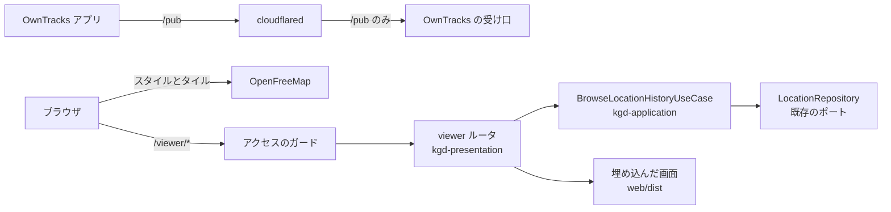
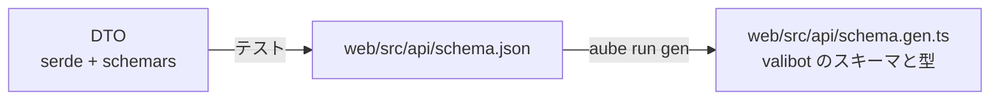

# 位置ログのブラウザビューア 設計

## 背景

OwnTracks の位置情報は #88 で kgd が受信して PostgreSQL に保存し、#90 で前日の日報日ぶんを地図画像と集計値にまとめて日報へ載せるようになった。
記録を振り返る手段は、この日次レポートの静止画だけである。
対象の日は日報日で固定されており、地図を拡大したり、数日から数か月にわたる期間をまとめて見たりはできない。

[日次レポートの設計書](2026-09-29-location-daily-report-design.md) は「全データの閲覧」を非目標として別の設計書に回していた。
本設計がその閲覧を扱う。

## 目的

- カレンダーで選んだ任意の期間の軌跡を、拡大や移動ができる地図でブラウザから見られるようにする
- 同じ期間について、期間全体の合計と 1 日ごとの集計をグラフで見られるようにする
- API の入出力の型を Rust の serde の型から生成し、画面側で valibot により検証する

## 非目標

- **LAN の外からの閲覧**。今は LAN の中からだけ見られればよい。将来 Cloudflare Access を前に立てて公開する余地は残すが、本設計では公開しない
- **aoi 上の Web サーバーを一元管理する入口**。kgd の外の別プロジェクトとして扱う
- **時刻単位での範囲指定**。範囲は日付の単位で選ぶ。時間帯を絞りたいときは地図を拡大して見る
- **週ごとや月ごとにまとめた集計**。1 日ごとの棒が多すぎて見づらくなってから検討する
- **場所から日時を探す逆引き**と、**点ごとの詳細表示**
- **地図タイルの中継**。ブラウザがタイルの配信元から直接取得する
- **期間の長さの上限**。「既知の制約」を参照

## 決定事項の一覧

| 項目 | 決定 |
|---|---|
| アクセス | LAN のみ。OwnTracks の受け口 (`[location] listen`、既定 8081) と同じ待ち受けに同居させ、`/viewer/` の下に置く |
| 保護 | 5 つの独立したガードを重ねる (「アクセスの保護」を参照) |
| 画面 | React、Vite、TypeScript。パッケージマネージャーは aube |
| 配布 | Dockerfile のビルド専用の Node の段でビルドし、rust-embed でバイナリに埋め込む |
| 地図 | MapLibre GL JS と `@vis.gl/react-maplibre`。タイルは OpenFreeMap のベクタータイルをブラウザから直接取得する |
| 1 日の区切り | `diary.timezone` の 0 時。日報日の区切り (`day_start_hour`) は使わない |
| 軌跡の点数 | 設定した上限を超えたら、サーバーで Visvalingam-Whyatt 法により間引く |
| 型の共有 | schemars で JSON Schema を出し、自前のスクリプトで valibot のスキーマに変換する |

1 日を 0 時で区切るため、ビューアの 1 日の数字は日報日で区切る日次レポートの数字とは一致しない。
これは利用者の選択である。

## 全体構成



OwnTracks の受け口とビューアは同じ axum のサーバーで動く。
bootstrap がビューアのルータを OwnTracks のルータへ merge する。

## 設定

```toml
[location.viewer]
# ビューアに届いてよい送信元。既定は LAN のプライベート帯で、loopback は含まない
# allowed_cidrs = ["10.0.0.0/8", "172.16.0.0/12", "192.168.0.0/16", "fd00::/8"]
# 地図に返す軌跡の点数の上限。超えたら形を保って間引く
# max_track_points = 20000
```

`[location.viewer]` のセクションがあるときだけビューアを有効にする。
セクションが無ければビューアのルートは登録しない。
kgd を更新しただけでビューアが動き出すことは無い。

待ち受けのアドレスは `[location] listen` を共有する。
精度のしきい値は `[location] max_accuracy_m` を、タイムゾーンは `diary.timezone` を使う。

`max_track_points` の既定値 20000 は、1 日に 1000 点ほど記録されている現状で、およそ 20 日ぶんにあたる。

## アクセスの保護

8081 は cloudflared を通して `owntracks.<ドメイン>` としてインターネットに公開されている。
ビューアを同じ待ち受けに置くと、何もしなければ位置の履歴が認証なしで外から見える。
cloudflared は host ネットワークから `127.0.0.1` で kgd に接続するため、kgd から見るとトンネル経由のリクエストはローカルからのリクエストと区別がつかない。

そこで、どれか 1 つの設定を誤っても他で止まるよう、独立したガードを重ねる。

1. **明示的な有効化**：`[location.viewer]` を書いたときだけビューアのルートを登録する
2. **送信元 IP の許可リスト**：ソケットの相手アドレス (axum の `ConnectInfo<SocketAddr>`) が `allowed_cidrs` に含まれるときだけ応答する。既定値に loopback を含めないため、同じホストの cloudflared から届くリクエストはこれだけで拒否される。`X-Forwarded-For` などのヘッダは判定に使わない。`listen` を `[::]` にしたときは IPv4 の相手が `::ffff:192.168.1.10` のような IPv4 射影アドレスで届くため、IPv4 のアドレスに戻してから照合する
3. **Cloudflare 経由の印による拒否**：`Cf-Connecting-IP`、`Cf-Ray`、`Cdn-Loop: cloudflare` のいずれかがあれば、送信元 IP によらず拒否する。これらは Cloudflare のエッジが付与し、インターネット側の利用者には取り除けない。cloudflared が別のホストへ移り、送信元が LAN のアドレスになってもトンネル経由のリクエストを止められる
4. **cloudflared のパスの許可リスト**：`owntracks.` のホスト名の ingress に `path: ^/(pub|healthz)$` を付け、それ以外のパスを 404 にする。拒否リストではなく許可リストにするため、ビューアのパスが増えても cloudflared の設定を直す必要が無い
5. **公開状態の確認コマンド**：`just check-exposure <URL>` で、外から `/viewer/` と `/viewer/api/history` が 404 か 403 になること、`/healthz` が 200 になることを確かめる。デプロイの後に実行する

ガード 2 と 3 はビューアのルートだけにかける。
`/pub` と `/healthz` はこれまでどおり cloudflared 経由で届き、`/pub` は既存の Basic 認証で守る。

拒否したときは 403 を返し、拒否の理由 (許可リスト外、Cloudflare の印) と送信元を warn のログに残す。

ガード 2 と 3 は、将来 Cloudflare Access を前に立ててトンネルから公開したくなったときにも公開を止める。
これは意図した挙動であり、公開するときは設定を明示的に変え、同時にオリジン側での Access の JWT 検証を足す。

## 各層に置くもの

### kgd-domain

純粋関数として置き、単体テストを付ける。

- **日付範囲の変換**：開始日と終了日 (どちらも含む) とタイムゾーンから、UTC の半開区間 `[開始日の 0 時, 終了日の翌日の 0 時)` を返す
- **日付ごとの分割**：時刻順の点列を、タイムゾーンでの日付ごとに分ける。範囲内で点の無い日も空の列として含める
- **集計の足し合わせ**：日ごとの `LocationSummary` を足し合わせて期間全体の集計を作る。点数、除外数、距離、移動種別ごとの距離、移動時間、静止時間は和をとり、最初と最後の記録時刻は最小と最大をとる
- **軌跡の間引き**：`TrackSegment` の列を、点数の合計が上限以下になるまで Visvalingam-Whyatt 法で間引く

集計には既存の `filter_accurate`、`summarize`、`split_segments` をそのまま使う。

間引きの詳細は次のとおりである。

- すべての区間の内側の点を 1 つの優先度付きキューに入れ、前後の点と作る三角形の面積が最も小さい点から取り除く。区間ごとに別々に間引かないのは、長い区間と短い区間で細かさをそろえるためである
- 面積は、緯度経度を区間の近くで平面に近似した座標 (経度方向に緯度の余弦を掛ける) で計算する
- 区間の始点と終点は取り除かない。移動種別の色の切れ目の位置が変わらない
- 始点と終点だけで上限を超えるときは、それ以上は間引かずに返す
- 点数が上限以下なら何もしない

点数の上限を直接指定できるため、Douglas-Peucker 法ではなく Visvalingam-Whyatt 法を使う。
Douglas-Peucker 法は許容する誤差を指定する方式であり、点数の上限に合わせるには誤差を探索し直す必要がある。

### kgd-application

`BrowseLocationHistoryUseCase` を追加する。
依存するポートは既存の `LocationRepository` だけで、新しいポートは作らない。

入力は開始日、終了日、タイムゾーン、精度のしきい値、点数の上限である。
処理は次の順で行う。

1. 日付範囲を UTC の範囲に変換する
2. `locations_between` で範囲の点を 1 回だけ読む
3. `filter_accurate` で精度の悪い点を除く
4. 日付ごとに分け、日ごとに `summarize` する。除外数も日ごとに数える
5. 日ごとの集計を足し合わせて期間全体の集計を作る
6. 精度で絞った全点に `split_segments` をかけ、上限を超えていれば間引く

出力は期間全体の集計、日ごとの集計、区間の列、間引く前と後の点数、間引いたかどうかである。

期間全体の集計を日ごとの集計の和にするため、グラフの棒の和と合計は一致する。
一方で、0 時をまたぐ 2 点の間隔はどちらの日にも数えない。
全点を一度に `summarize` すればこの間隔も数えられるが、合計とグラフの和がずれる。
ずれの無さを優先する。

### kgd-presentation

`viewer` モジュールを追加する。

- **ルータ**：`/viewer/api/history` と、埋め込んだ画面の配信をまとめる。ガードをミドルウェアとしてかける
- **ガードの判定**：送信元のアドレス、Cloudflare の印の有無、許可リストから、通すか拒否の理由を返す純粋関数として切り出す
- **API のハンドラ**：クエリを検証してユースケースを呼び、結果を Presenter で DTO にする
- **DTO と Presenter**：応答の型に `#[derive(Serialize, JsonSchema)]` を付ける。schemars への依存は kgd-presentation に閉じ、domain と application には持ち込まない
- **画面の配信**：rust-embed で `web/dist` を埋め込み、`/viewer/` 以下のパスで返す。`/viewer/api/` 以外で該当するファイルが無いパスには `index.html` を返す。`/viewer/api/` 以下の未知のパスは JSON の 404 にする。API のパスの誤りが HTML の 200 として返り、画面側で原因のわかりにくいスキーマ検証のエラーになるのを避けるためである。`web/dist` が無い状態でビルドした場合は「画面が未ビルドです」のページだけを返す

### kgd (bootstrap)

- `[location.viewer]` があれば、`BrowseLocationHistoryUseCase` を組み立て、ビューアのルータを OwnTracks のルータへ merge する
- 送信元のアドレスを取れるよう、`serve_http` で `into_make_service_with_connect_info::<SocketAddr>()` を使う

## API

### リクエスト

```
GET /viewer/api/history?from=2026-09-01&to=2026-09-30
```

`from` と `to` は `YYYY-MM-DD` 形式の日付で、どちらもその日を含む。

### レスポンス

```json
{
  "range": { "from": "2026-09-01", "to": "2026-09-30", "timezone": "Asia/Tokyo" },
  "total": {
    "distance_m": 123456.0,
    "distance_by_activity": { "walking": 8000.0, "cycling": 0.0, "automotive": 110000.0, "unknown": 5456.0 },
    "moving_s": 36000,
    "stationary_s": 50000,
    "point_count": 31000,
    "excluded_count": 120,
    "first_at": "2026-09-01T00:03:12Z",
    "last_at": "2026-09-30T23:58:40Z"
  },
  "days": [
    { "date": "2026-09-01", "summary": { "distance_m": 4000.0, "...": "total と同じ項目" } }
  ],
  "track": {
    "type": "FeatureCollection",
    "features": [
      {
        "type": "Feature",
        "properties": { "activity": "walking" },
        "geometry": { "type": "LineString", "coordinates": [[139.7, 35.6], [139.71, 35.61]] }
      }
    ]
  },
  "track_meta": { "original_points": 31000, "returned_points": 20000, "simplified": true }
}
```

- `distance_by_activity` は `walking`、`cycling`、`automotive`、`unknown` の 4 つのキーを常に持つ。静止は距離を持たないため含めない
- `first_at` と `last_at` は点が無ければ `null` にする
- `days` は範囲内のすべての日を日付順に並べる
- `track` は GeoJSON の FeatureCollection で、区間ごとに 1 つの LineString を持つ。`activity` は `walking`、`cycling`、`automotive`、`stationary`、`unknown` のいずれかである。点が 1 つだけの区間は、同じ座標を 2 つ並べた LineString にする
- `original_points` は精度で絞った後、間引く前の点数である (区間の境目の点は両方の区間で数える)

### エラー

| 状況 | 応答 |
|---|---|
| 日付の形式が不正、または `from` が `to` より後 | 400、`{ "error": "<理由>" }` |
| DB のエラー | 500、`{ "error": "internal error" }`。詳細は error のログにだけ残す |
| 範囲に点が無い | 200。`days` は集計が 0 の日を並べ、`track` は空の FeatureCollection にする |
| ガードで拒否 | 403 |

## 型の生成

API の入出力の型は Rust の DTO を正とし、画面側の valibot のスキーマを生成する。



1. kgd-presentation のテストが DTO から JSON Schema を作り、コミット済みの `web/src/api/schema.json` と比べる。違えば失敗する。環境変数 `UPDATE_API_SCHEMA=1` を付けたときだけファイルを上書きする
2. `web/scripts/` の変換スクリプトが `schema.json` から `schema.gen.ts` を作る。valibot のスキーマと、`InferOutput` による TypeScript の型を出力する
3. `just gen-api` は 1 と 2 を順に実行する

生成物は 2 つともコミットする。
Docker の Node の段が Rust 無しでビルドでき、API の変更がレビューの差分に現れる。

変換スクリプトは自前で書く。
JSON Schema から valibot への既存の変換ツールは、最も知られていた `liam-hq/json-schema-to-valibot` が 2026 年 6 月にアーカイブされており、他の実装も利用者が少ない。
対応するのは今回の DTO が使う範囲 (object、array、string と date および date-time の format、number、integer、enum、null の許容、`$ref` と `$defs`) に限る。
それ以外のキーワードに出会ったら、無視せずにエラーで止める。

Rust の型から valibot を直接出す specta-valibot も検討したが、採らない。
specta 2 は RC の段階にあり、specta-valibot は README で部分的な実装とされ、crates.io に公開されていない。
git 依存になるため、`deny.toml` の `allow-git` に例外を足す必要もある。

画面は API の応答を必ず `v.parse` に通してから使う。

## 画面

### レイアウト

- **期間の選択**：画面上部に、react-day-picker の範囲選択のカレンダーと、よく使う範囲のボタン (今日、昨日、直近 7 日、今月) を置く
- **地図**：画面の中央に置く。読み込んだら軌跡全体が収まるように表示範囲を合わせる
- **集計**：横に広い画面では地図の右、狭い画面では地図の下に置く

### 地図

MapLibre GL JS を `@vis.gl/react-maplibre` から使い、OpenFreeMap のスタイルを読み込む。
帰属表示は MapLibre の帰属表示の欄に出す。

軌跡は `track` をそのまま GeoJSON のソースに渡し、線のレイヤーで描く。
線の色は `activity` で分け、日次レポートの `segment_rgb` とそろえる。

| activity | 色 |
|---|---|
| walking | `#2e9e44` |
| automotive | `#1f6fd1` |
| cycling | `#f08c1a` |
| stationary | `#c0392b` |
| unknown | `#808080` |

`track_meta.simplified` が true なら、地図の隅に「20,000 / 31,000 点に間引いて表示中」のように表示する。
点が無ければ「この期間の記録はありません」と表示する。

### 集計

期間全体の合計として、移動距離とその内訳、移動時間と静止時間、記録点数と除外数、最初と最後の記録時刻を表示する。
時刻は応答の `range.timezone` で表示する。

1 日ごとのグラフは Recharts で次の 3 つを描く。

- 移動距離 (移動種別ごとの積み上げ棒)
- 移動時間と静止時間
- 記録点数と除外数

グラフの棒をクリックすると、期間をその日だけに絞る。

### 状態とデータの取得

選んだ期間は URL のクエリ `?from=...&to=...` に持つ。
再読み込みやブックマークで同じ期間を開ける。
クエリが無ければ今日を開く。

データの取得は、fetch と valibot の `parse` を包んだ自前のフックで行う。
期間を変えたら、前のリクエストを AbortController で取り消す。
取得の失敗やスキーマに合わない応答は画面にエラーとして表示し、詳細をコンソールに出す。
TanStack Query のようなライブラリは使わない。

### 道具

- スタイルは CSS Modules を使う (Vite が標準で扱えるため依存が増えない)
- 型チェックは `tsc --noEmit`、lint と整形は Biome で行う
- テストは Vitest で、スキーマの変換、日付と URL の扱い、activity と色の対応のような純粋な処理だけを対象にする。見た目は手で確かめる

## ビルドと配布

### ディレクトリ

画面のソースはリポジトリ直下の `web/` に置く。
`package.json`、`aube-lock.yaml`、Vite の設定、`src/`、`scripts/` を含む。
Vite の `base` は `/viewer/` にする。

### Docker

Dockerfile に、画面をビルドする段を足す。

```dockerfile
FROM --platform=$BUILDPLATFORM node:22-bookworm-slim AS web
# aube をバージョンを固定して入れる
WORKDIR /web
COPY web/package.json web/aube-lock.yaml ./
RUN aube ci
COPY web/ ./
RUN aube run build
```

builder の段では、`cargo build` の前に `COPY --from=web /web/dist web/dist` を行い、続けて `RUN test -f web/dist/index.html` で画面のビルド結果があることを確かめる。
rust-embed はフォルダが無くてもビルドを通すため、この確認が無いと、段の順序の誤りなどで画面を含まないイメージができても気づけない。
実行用のイメージ (`runtime-base`) は変えず、Node は含めない。
`.dockerignore` に `web/node_modules` と `web/dist` を足す。

### 手元の開発

- `mise.toml` に `node` と `aube` を足す。`package.json` の `devEngines.runtime` でも Node のバージョンを固定する
- Justfile に `web-dev`、`web-build`、`gen-api`、`check-exposure` を足す
- `web-dev` は Vite の開発サーバーを起動し、`/viewer/api` を `127.0.0.1:8081` へプロキシする

Vite の開発サーバーからのプロキシは `127.0.0.1` から届くため、既定の許可リストでは 403 になる。
手元の `config.toml` でだけ `allowed_cidrs` に `127.0.0.1/32` を足す。
`config.example.toml` にこの旨を書く。
Cloudflare の印による拒否は開発中も有効である。

### CI

`build.yml` に `web` のジョブを足す。
mise で Node と aube を入れ、`aube ci`、型チェック、lint、テストを実行する。
さらに `aube run gen` で `schema.gen.ts` を作り直し、`git diff --exit-code` で生成物のずれを検出する。

`schema.json` のずれは、既存の Rust のジョブで流れる kgd-presentation のテストが検出する。

## デプロイ

1. 本番の cloudflared の config (リポジトリの外で管理している) の `owntracks.` の ingress に `path: ^/(pub|healthz)$` を足し、cloudflared を再起動する
2. 本番の `config.toml` に `[location.viewer]` を足し、新しいイメージで kgd を起動する
3. `just check-exposure https://owntracks.<ドメイン>` を実行し、`/viewer/` が外から 404 か 403 になることを確かめる
4. LAN の端末から `http://<aoi のアドレス>:8081/viewer/` を開いて表示を確かめる

リポジトリの `cloudflared.example/config.yml` にも 1 の変更を入れ、README にこの順番を書く。
`compose.yml` は変えない。

## テスト

### kgd-domain

- 日付範囲の変換：終了日を含むこと、`Asia/Tokyo` の 0 時が UTC の前日 15 時になること
- 日付ごとの分割：0 時の直前と直後の点が別の日に入ること、点の無い日も含まれること
- 集計の足し合わせ：各項目の和、最初と最後の記録時刻、点の無い日を含むとき
- 間引き：上限を守ること、区間の始点と終点が残ること、始点と終点だけで上限を超えるときの扱い、上限以下なら変えないこと

### kgd-application

`MockLocationRepository` を使い、次を確かめる。

- 日付範囲から変換した UTC の範囲で `locations_between` を 1 回呼ぶこと
- 精度で除外した点が集計から外れ、除外数に数えられること
- 日ごとの集計と合計が一致すること
- 上限を超えたときだけ間引きの結果と `simplified` が立つこと

### kgd-presentation

- ガードの判定関数を、送信元のアドレスと Cloudflare の印の組み合わせの表でテストする。IPv4 射影アドレスで届いた LAN の相手を通すことも含める
- ルータのテストでは、axum の `MockConnectInfo` で送信元を差し替え、次を確かめる
  - loopback からのリクエストは 403
  - LAN のアドレスでも Cloudflare の印があれば 403
  - LAN のアドレスからは 200
  - `/pub` はこれまでどおり `127.0.0.1` から Basic 認証で通る
  - `/viewer/` 以下の未知のパスに `index.html` を返す
  - `/viewer/api/` 以下の未知のパスは JSON の 404
  - 日付の形式が不正なら 400
  - 画面が未ビルドのときは案内のページを返す
- `schema.json` のスナップショットの一致

### web

Vitest で、スキーマの変換 (対応する各キーワードと、未対応のキーワードでのエラー)、日付と URL のクエリの相互変換、activity と色の対応を確かめる。

## ドキュメント

- `docs/architecture.md` に、ビューアのルータ、`BrowseLocationHistoryUseCase`、`web/` を追記する
- ADR を 2 本書く
  - 0013：ビューアを OwnTracks の受け口と同じ待ち受けに置き、多重のガードで守る
  - 0014：画面は React と Vite で作り、Docker のビルド段でビルドしてバイナリに埋め込み、API の型は schemars から valibot を生成する
- `config.example.toml` に `[location.viewer]` を追記する

## 既知の制約

- 期間の長さに上限は無い。間引く前の点をすべてメモリに読むため、1 年ぶん (約 40 万点) で数十 MB 程度を見込む。数年ぶんを選ぶと重くなる可能性があり、問題になった時点で対処する
- OpenFreeMap の提供が止まると地図の背景が表示されなくなる。軌跡と集計は表示される
- 0 時をまたぐ 2 点の間隔は、どちらの日の集計にも数えない
- ガード 2 と 3 は、前に立つのが cloudflared であることを前提にしている。Cloudflare 以外のリバースプロキシ (将来の aoi の一元管理の入口や、Docker のブリッジネットワーク上のコンテナなど) を kgd の前に置くと、送信元はプライベートなアドレスになり Cloudflare の印も付かないため、ビューアに認証なしで届く。既定の `172.16.0.0/12` は Docker のブリッジの範囲も含む。そのような入口を置くときは、許可リストをその入口だけに絞って入口側で認証するか、kgd 側に認証を足すかを改めて決める
- 「今日」などの範囲のボタンは、ブラウザの現地の日付で計算する。サーバーは日付を `diary.timezone` で解釈するため、ブラウザと `diary.timezone` のタイムゾーンが違うと 1 日ずれる。今は両方とも日本時間なので対処しない

## 実装時に確認する事項

設計時点で一次資料を確認できていないため、実装の最初に確かめる。

- aube を Docker の段に入れる方法と、linux/arm64 で動くこと。aube のプロジェクト自身のインストール手順で確かめる。npm 上の同名に見えるパッケージが本物かは確かめられていないため、確認できるまではリポジトリで既に使っている mise で入れる方法を優先する
- rust-embed で、埋め込むフォルダが無いときにビルドを失敗させない方法 (`allow_missing` のような指定の有無)
- OpenFreeMap の利用条件と、日本の地名の表示言語
- cloudflared の ingress の `path` の書式
- `@vis.gl/react-maplibre` の現在のパッケージ名と React のバージョンの対応
